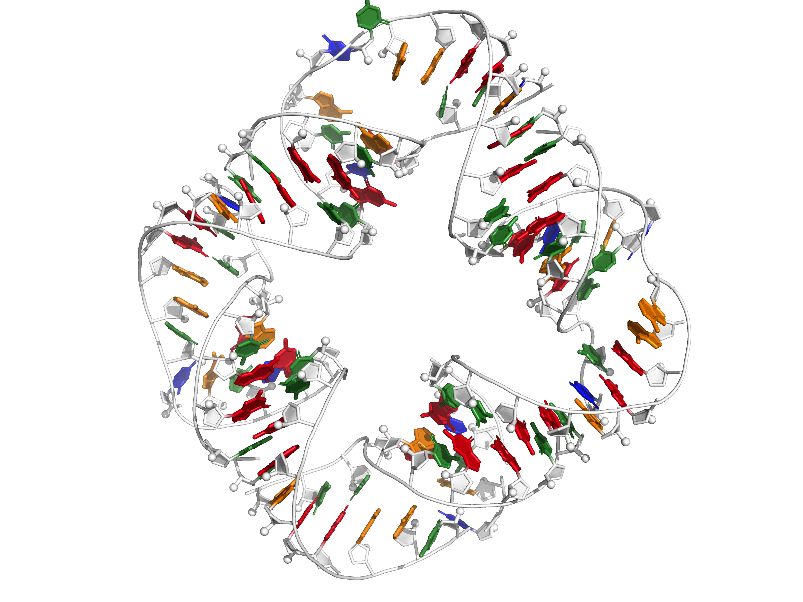
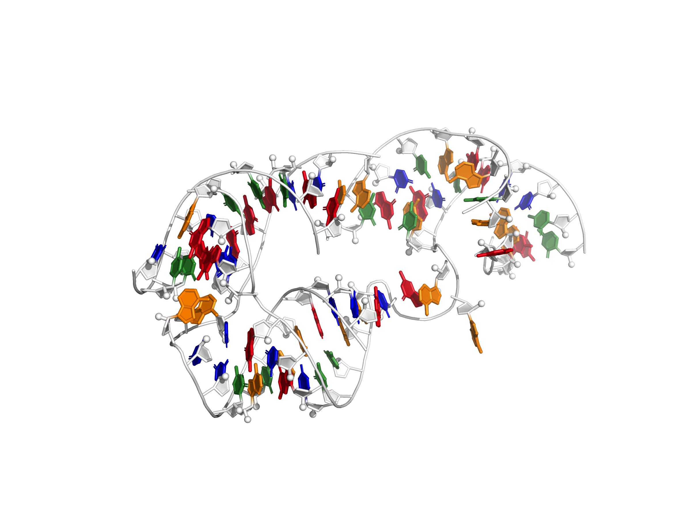

<table>
	<tr>
		<td align="center">rna_puzzle_12  RNA-puzzle 12</td>
		<td align="center">rna_puzzle_15  RNA-puzzle 15</td>
		<td align="center">rna_puzzle_5_p15_p3_p8  RNA-puzzle 5 three-way junction</td>
	</tr>
	<tr>
		<td align="center">rna_puzzle_4_with_3IQP  RNA-puzzle 4, using a large chunk of a homologous structure known at the time</td>
		<td align="center">rna_puzzle_4_align_to_3iqp  RNA-puzzle 4, merely aligning to the starting structure</td>
		<td align="center">rna_puzzle_7  RNA-puzzle 7</td>
	</tr>
	<tr>
		<td align="center">rna_puzzle_5_p4p6_most  RNA-puzzle 5 p4p6 aggressive subproblem</td>
		<td align="center">rna_puzzle_13  RNA-puzzle 13</td>
		<td align="center">rna_puzzle_1  RNA-puzzle 1</td>
	</tr>
	<tr>
		<td align="center">rna_puzzle_19  RNA-puzzle 19</td>
		<td align="center">rna_puzzle_4  RNA-puzzle 4</td>
		<td align="center">rna_puzzle_8  RNA-puzzle 8</td>
	</tr>
	<tr>
		<td align="center">rna_puzzle_2  RNA-puzzle 2</td>
		<td align="center">rna_puzzle_14_bound  RNA-puzzle 14, ligand-bound</td>
		<td align="center">rna_puzzle_2  RNA-puzzle 2</td>
	</tr>
	<tr>
		<td align="center">rna_puzzle_5  RNA-puzzle 5</td>
		<td align="center">rna_puzzle_3  RNA-puzzle 3</td>
		<td align="center">rna_puzzle_5_p15_p3_p8_with_dock  RNA-puzzle 5 docking subproblem</td>
	</tr>
	<tr>
		<td align="center">rna_puzzle_18  RNA-puzzle 18</td>
		<td align="center">rna_puzzle_5_p4p6_mini  RNA-puzzle 5 p4p6 'mini' subproblem</td>
		<td align="center">rna_puzzle_5_p2_p2.1_p10  RNA-puzzle 5 p2, p2.1, p10 three-way junction</td>
	</tr>
	<tr>
		<td align="center">rna_puzzle_6  RNA-puzzle 6</td>
		<td align="center">rna_puzzle_21  RNA-puzzle 21</td>
		<td align="center">rna_puzzle_10  RNA-puzzle 10</td>
	</tr>
	<tr>
		<td align="center">rna_puzzle_5_p4p6_micro  RNA-puzzle 5 p4p6 'micro' subproblem</td>
		<td align="center">rna_puzzle_18_with_4PQV  RNA-puzzle 18, with original homology</td>
		<td align="center">rna_puzzle_14_free  RNA-puzzle 14, ligand-free</td>
	</tr>
	<tr>
		<td align="center">rna_puzzle_17  RNA-puzzle 17</td>
		<td></td>
		<td></td>
	</tr>
</table>
