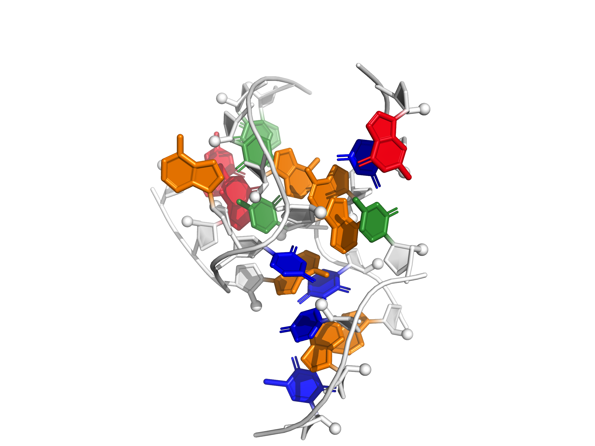

<table>
	<tr>
		<td align="center">gir1_p2p9_gaaa_minor  P2/P9 GAAA docking interaction from GIR1 lariat-capping ribozyme</td>
		<td align="center">gir1_p2.1p5_kiss  P2.1/P5 "kissing" interaction from GIR1 lariat-capping ribozyme</td>
		<td align="center">P5b_connect  P5b from P4-P6 group I ribozyme domain</td>
	</tr>
	<tr>
		<td align="center">hammerhead_3WJ_cat  Catalytic-like conformation, three-way-junction in hammerhead ribozyme</td>
		<td align="center">just_tr_P4P6  Receptor motif of canonical 11-nt tetraloop-receptor module in P4-P6 domain</td>
		<td align="center">cg_helix  A-form RNA helix, comprised of C-G base pair steps</td>
	</tr>
	<tr>
		<td align="center">hammerhead_tert_fixed  Catalytic-like conformation, tertiary interaction in hammerhead ribozyme</td>
		<td align="center">cg_helix_Zform  Z-form RNA helix, comprised of C-G base pair steps</td>
		<td align="center">hammerhead_3WJ_cat_fixed  Catalytic-like conformation, three-way-junction in hammerhead ribozyme</td>
	</tr>
	<tr>
		<td align="center">hammerhead_3WJ_precat  Pre-catalytic conformation, three-way-junction in hammerhead ribozyme</td>
		<td align="center">t_loop  T loop motif from unmodified tRNAPhe</td>
		<td align="center">tl_tr_P4P6_dock  Canonical 11-nt tetraloop-receptor module in P4-P6 domain</td>
	</tr>
	<tr>
		<td align="center">kink_turn_free  Kink-turn motif derived from SAM-I riboswitch</td>
		<td align="center">tl_tr_R1_inclGA  GGAA:R(1) tetraloop-receptor complex discovered through \\textit{in vitro} evolution</td>
		<td align="center">tl_tr_P4P6_inclGA  Canonical GAAA:11-nt tetraloop-receptor module in P4-P6 domain</td>
	</tr>
	<tr>
		<td align="center">hiv_rre  Rev response element high affinity site</td>
		<td align="center">hammerhead_3WJ_precat_fixed  Pre-catalytic conformation, three-way-junction in hammerhead ribozyme</td>
		<td align="center">g_quadruplex_fixed  RNA quadruplex from an inosine-tetrad</td>
	</tr>
	<tr>
		<td align="center">gaaa_minor_dock  Tetraloop-helix interaction in L1 ligase crystal</td>
		<td align="center">kiss_add_PK_dock  Pseudoknot docking interaction A-riboswitch-adenine complex</td>
		<td></td>
	</tr>
</table>
