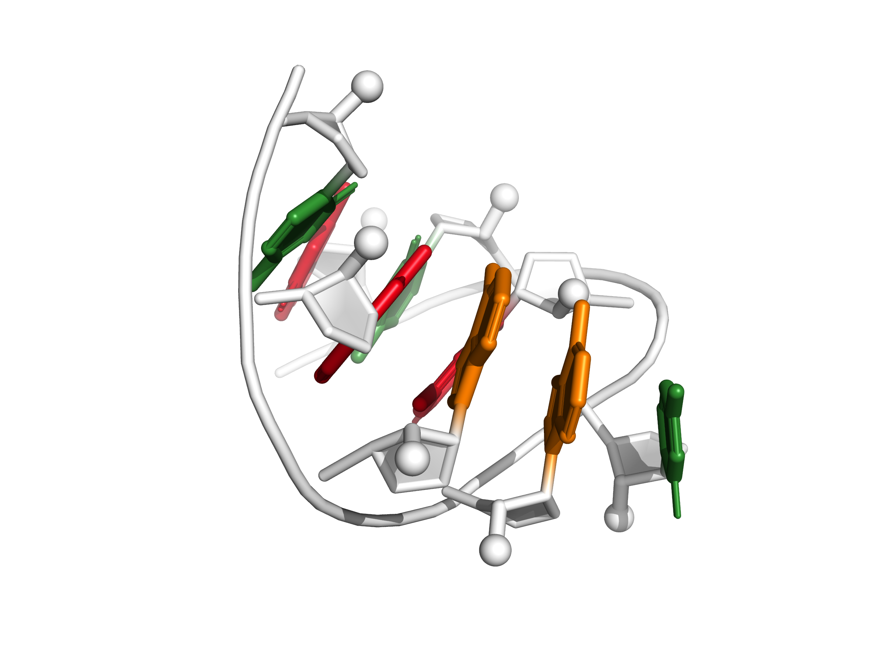
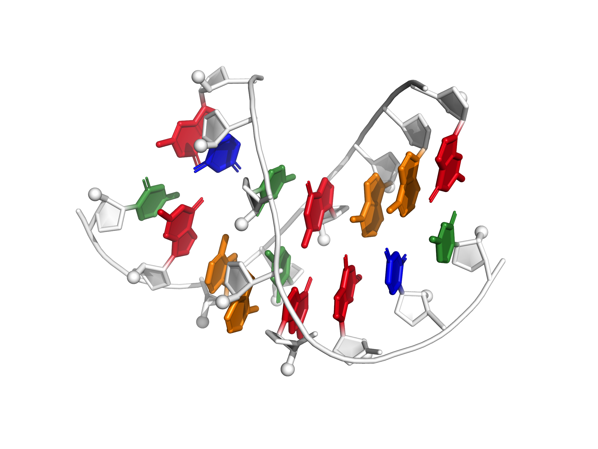

<table>
	<tr>
		<td align="center">gagua_pentaloop  GAGUA pentaloop from conserved SARS region</td>
		<td align="center">gcaa_tetraloop  GCAA tetraloop</td>
		<td align="center">tandem_ga_imino  Imino conformation of tandem G-A base pair steps</td>
	</tr>
	<tr>
		<td align="center">j44a_p4p6  J4/4a from P4-P6 domain</td>
		<td align="center">r2_4x4  4-by-4 nucleotide RNA internal loop from an R2 retrotransposon</td>
		<td align="center">uucg_tetraloop  UUCG tetraloop</td>
	</tr>
	<tr>
		<td align="center">srp_domainIV  Conserved domain of human signal-recognition particle</td>
		<td align="center">tandem_ga_sheared  Sheared conformation of tandem G-A base pair steps</td>
		<td align="center">srl_fixed  Bulged G motif from sarcin/ricin loop</td>
	</tr>
	<tr>
		<td align="center">srl_free_bulgedG  Bulged G motif from sarcin/ricin loop</td>
		<td align="center">gg_mismatch  G(syn)-G(anti) conformation of non-canonical guanosine-guanosine base pair</td>
		<td align="center">srp_domainIV_fixed  Conserved domain of human signal-recognition particle, modeled with fixed helix orientation</td>
	</tr>
</table>
