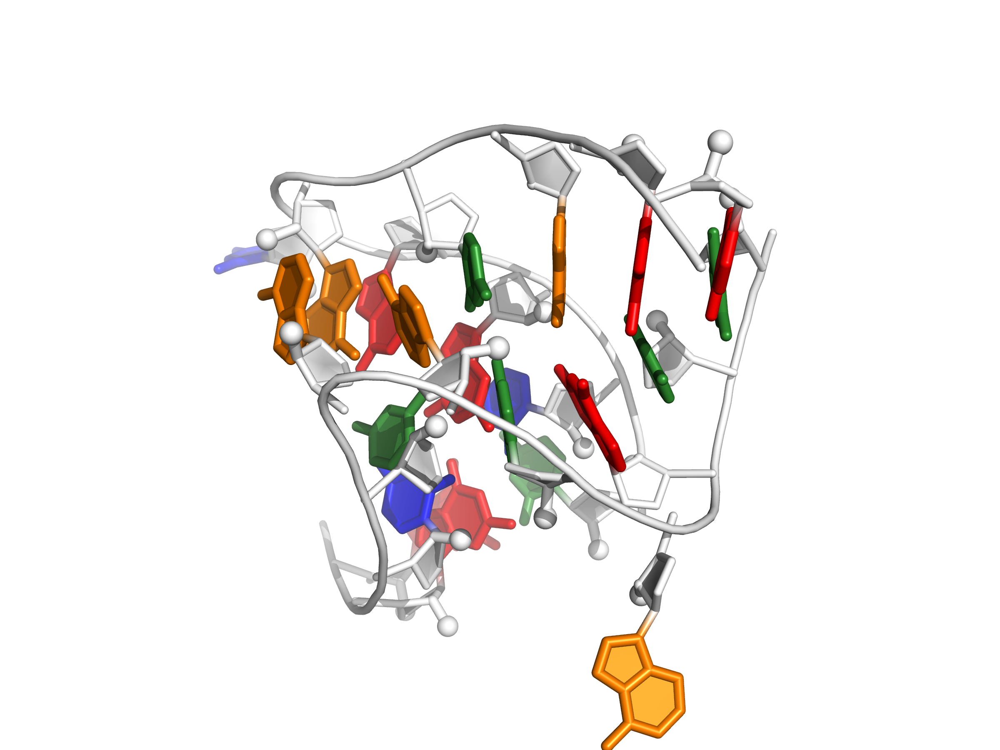
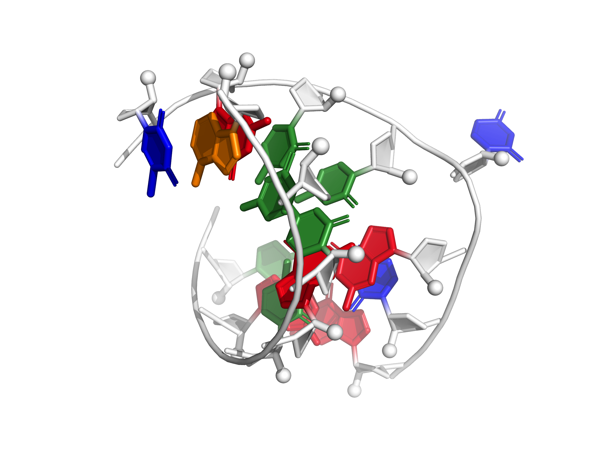
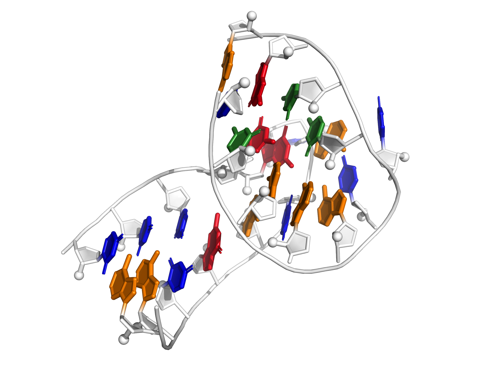
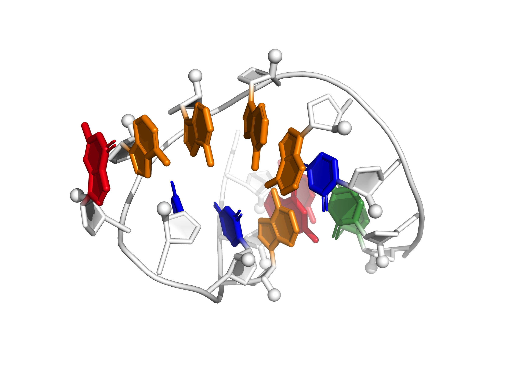
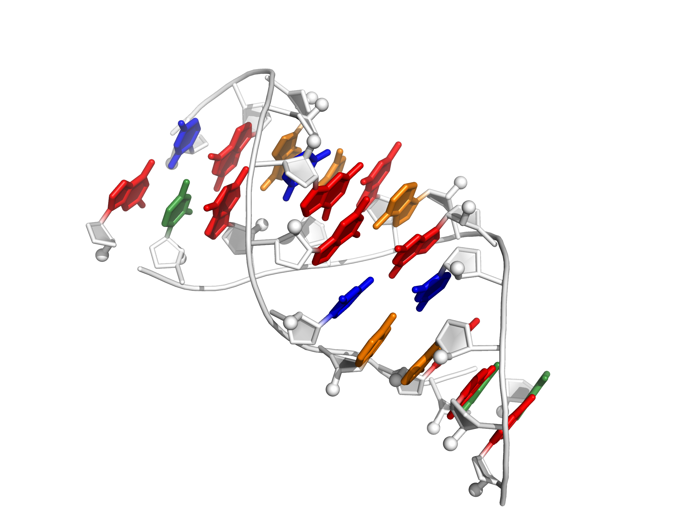
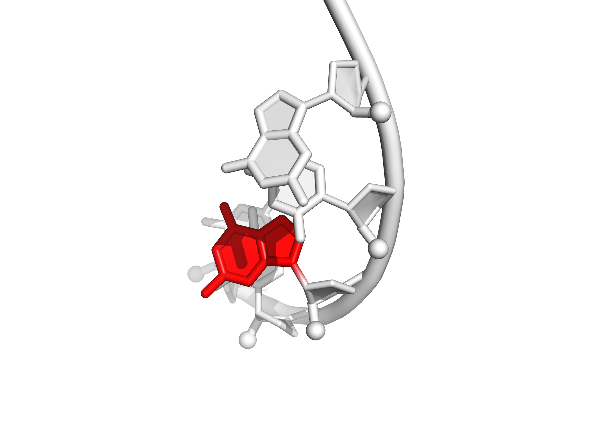
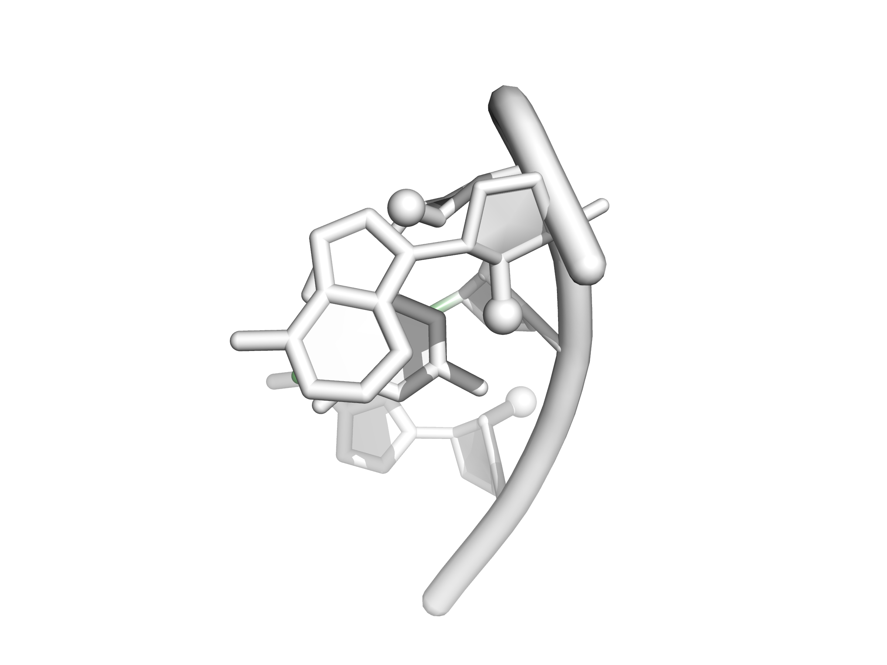
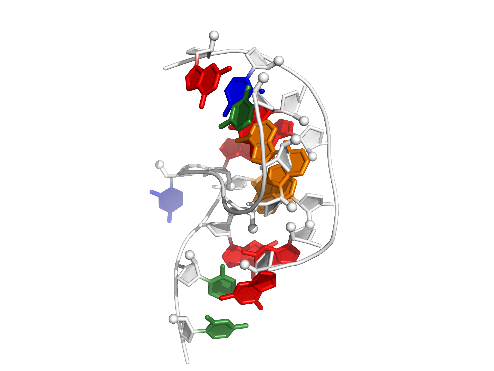
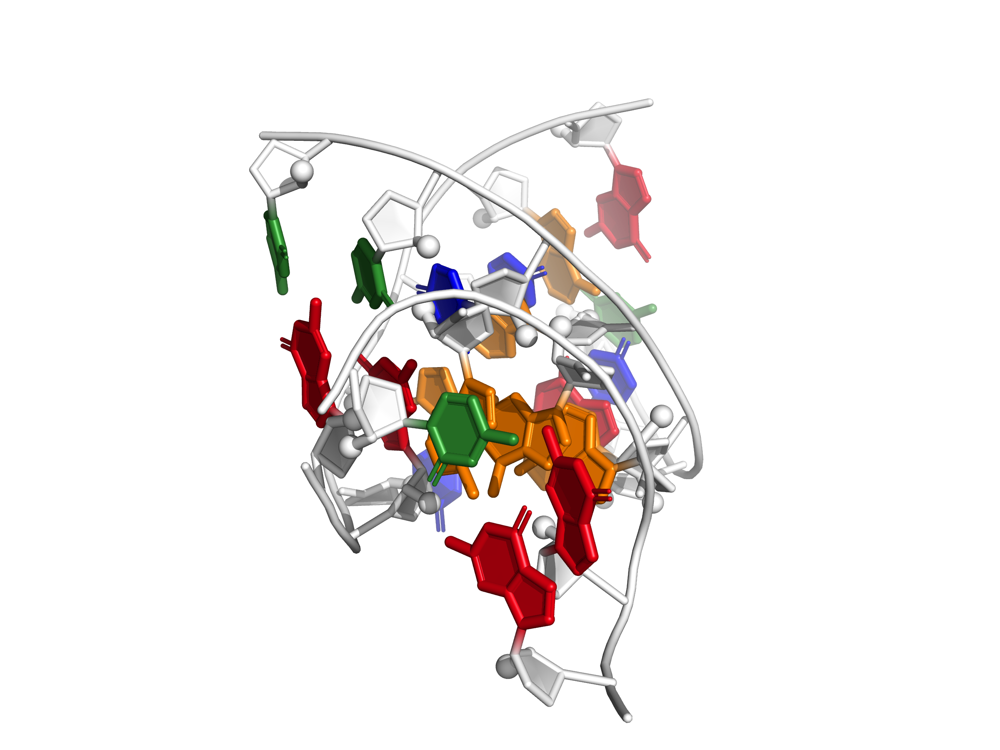
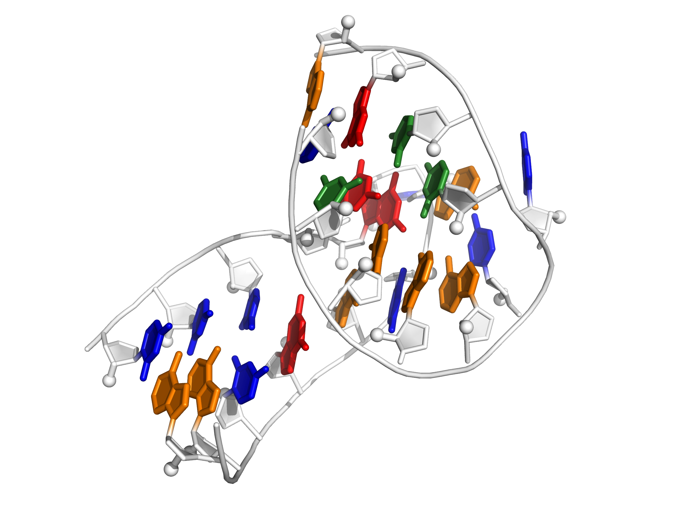

<table>
	<tr>
		<td align="center">kiss_add_L2_fixed  L2 (fixed) and L3 from A-riboswitch-adenine complex</td>
		<td align="center">j55a_P4P6_fixed  J5/5a "hinge" from the P4-P6 domain</td>
		<td align="center">puzzle1  Non-canonical junction from a human thymidylate synthase regulatory motif</td>
	</tr>
	<tr>
		<td align="center">kiss_add_L3_fixed  L2 and L3 (fixed) from A-riboswitch-adenine complex</td>
		<td align="center">anticodon  Anticodon loop of unmodified tRNAPhe</td>
		<td align="center">loopE  Loop E motif</td>
	</tr>
	<tr>
		<td align="center">puzzle1_alt_fixed  Alternative conformation of a non-canonical junction from a human thymidylate synthase regulatory motif</td>
		<td align="center">gagu_forcesyn  Major conformation of internal loop from RNA structural switch</td>
		<td align="center">gagu  Major conformation of internal loop from RNA structural switch</td>
	</tr>
	<tr>
		<td align="center">kink_turn_fixed  Kink-turn motif derived from SAM-I riboswitch</td>
		<td align="center">tl_tr_P4P6  Canonical 11-nt tetraloop-receptor module in P4-P6 domain</td>
		<td align="center">kiss_add_fixed  L2/L3 (both fixed) from A-riboswitch-adenine complex</td>
	</tr>
</table>
