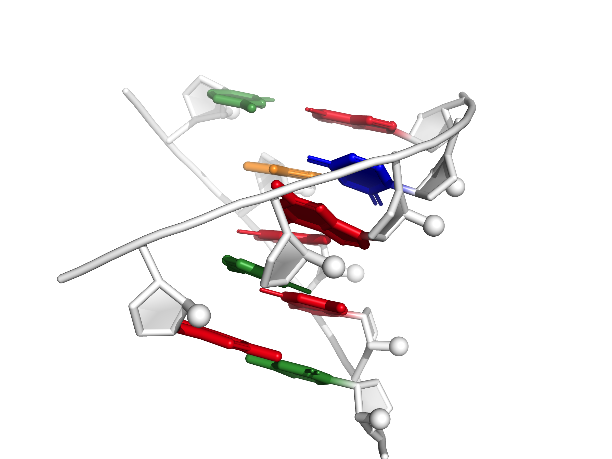
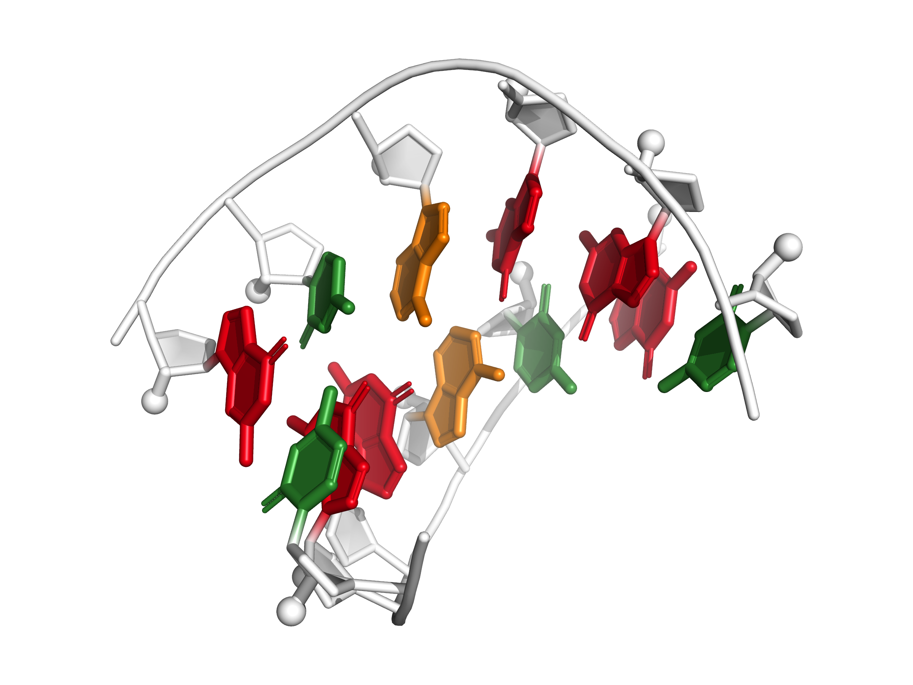

<table>
	<tr>
		<td align="center">gg_mismatch_fixed  G(syn)-G(anti) conformation of non-canonical guanosine-guanosine base pair</td>
		<td align="center">kink_turn_align  Kink-turn motif derived from SAM-I riboswitch</td>
		<td align="center">puzzle18_zika_PK  Zika xrRNA pseudoknot orientation puzzle</td>
	</tr>
	<tr>
		<td align="center">gir1_p2p9_gaaa_minor_fixed  P2/P9 GAAA docking interaction from GIR1 lariat-capping ribozyme</td>
		<td align="center">VS_rbzm_P3P4P5_align  VS ribozyme three-way-junction between P3, P4, and P5</td>
		<td align="center">bulged_tetraplex  A tetraplex with a bulge</td>
	</tr>
	<tr>
		<td align="center">parallel_AA  A parallel helix of adenosine, some of which are protonated</td>
		<td align="center">VS_rbzm_P3P4P5_fixed  VS ribozyme three-way-junction between P3, P4, and P5</td>
		<td align="center">j44a_p4p6_fixed  J4/4a from P4-P6 domain</td>
	</tr>
	<tr>
		<td align="center">VS_rbzm_P2P3P6_align  VS ribozyme three-way-junction between P2, P3, and P6</td>
		<td align="center">VS_rbzm_P2P3P6_fixed  VS ribozyme three-way-junction between P2, P3, and P6</td>
		<td align="center">hiv_rre_fixed  Rev response element high affinity site</td>
	</tr>
	<tr>
		<td align="center">loopE_fixed  Loop E motif</td>
		<td align="center">hammerhead_tert_align  Catalytic-like conformation, tertiary interaction in hammerhead ribozyme</td>
		<td align="center">cg_helix_Zform_fixnative  A Z-form cg helix, with a repaired native conformation</td>
	</tr>
	<tr>
		<td align="center">gagu_forcesyn_blockstackU  Major conformation of internal loop from RNA structural switch, with stacking blocked on U</td>
		<td align="center">tandem_ga_sheared_fixed  Sheared conformation of tandem G-A base pair steps</td>
		<td align="center">t_loop_align  T-loop from tRNA phe</td>
	</tr>
	<tr>
		<td align="center">t_loop_fixed  T-loop from tRNA phe</td>
		<td align="center">gir1_p2.1p5_kiss_fixed  P2.1/P5 "kissing" interaction from GIR1 lariat-capping ribozyme</td>
		<td align="center">r2_4x4_fixed  4-by-4 nucleotide RNA internal loop from an R2 retrotransposon</td>
	</tr>
	<tr>
		<td align="center">tandem_ga_imino_fixed  Imino conformation of tandem G-A base pair steps</td>
		<td align="center">j55a_P4P6_align  J5/5a "hinge" from the P4-P6 domain</td>
		<td align="center">just_tr_P4P6_fixed  Receptor motif of canonical 11-nt tetraloop-receptor module in P4-P6 domain</td>
	</tr>
</table>
