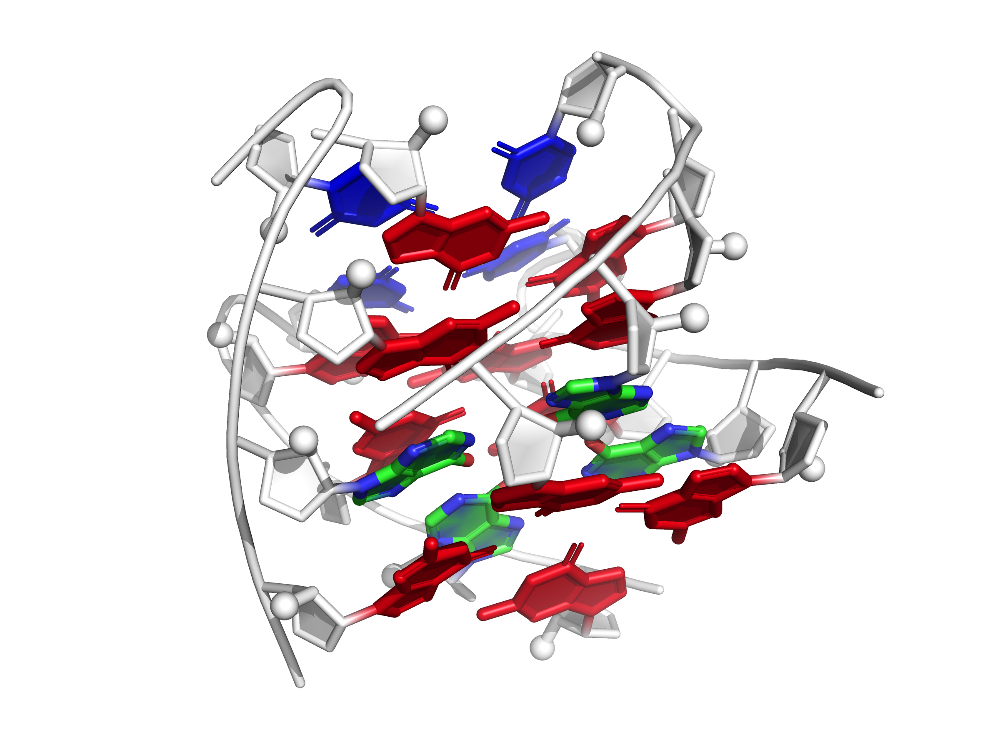
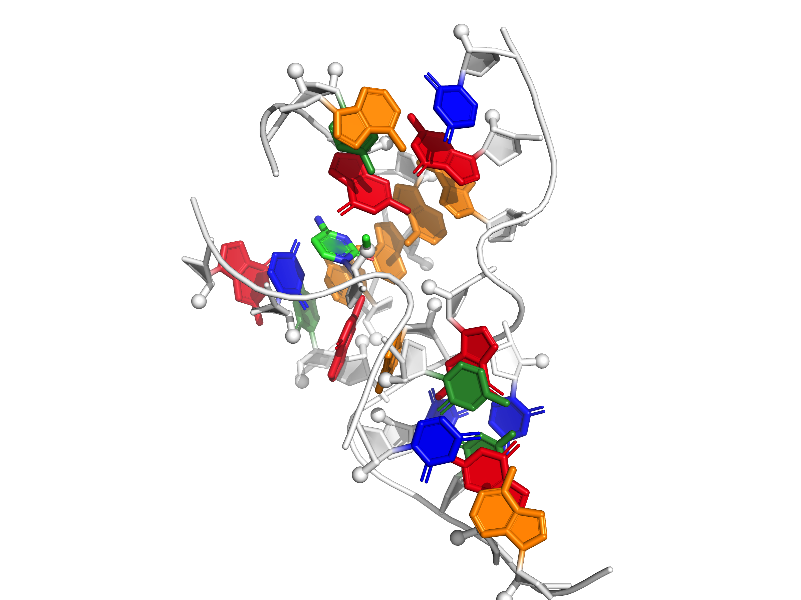
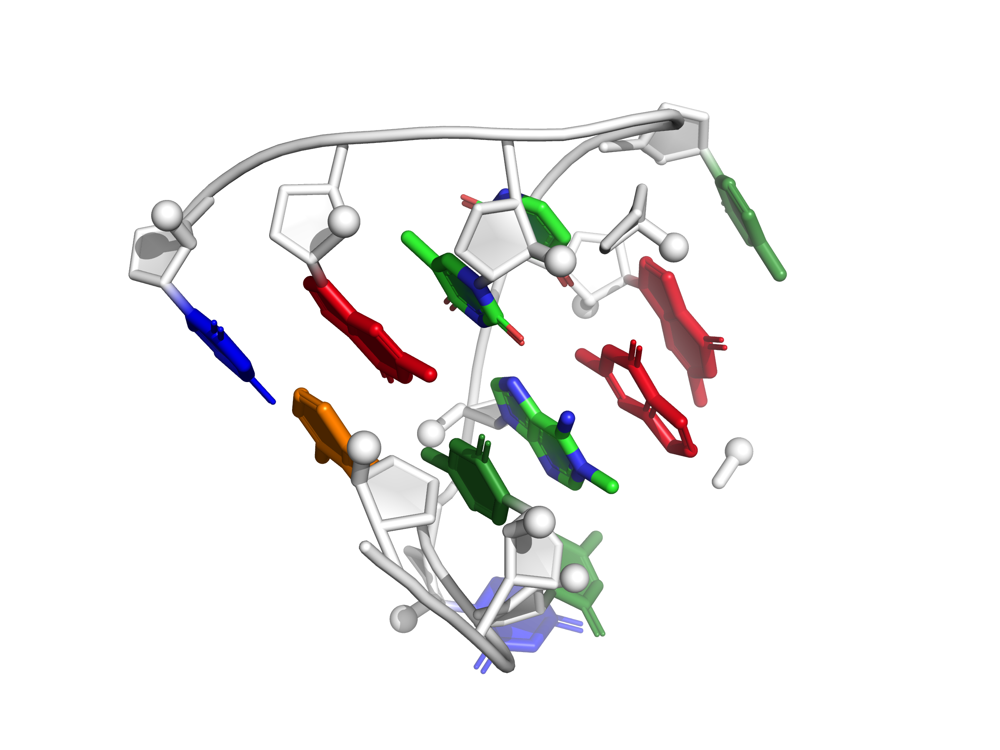
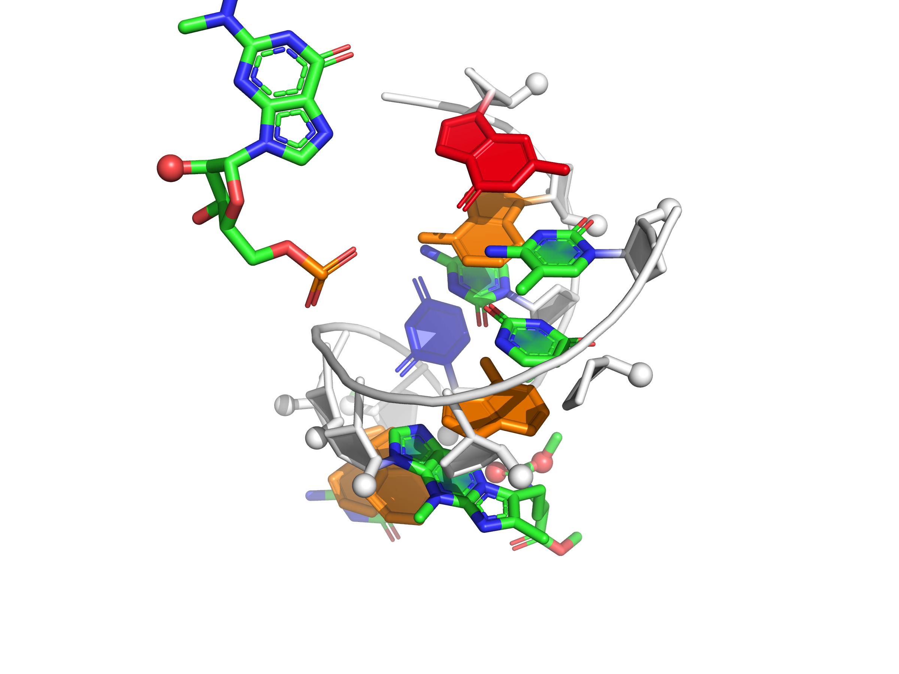
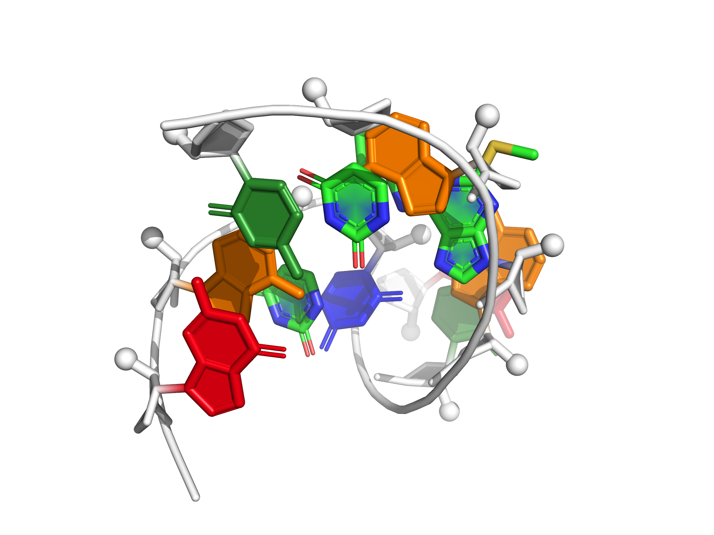
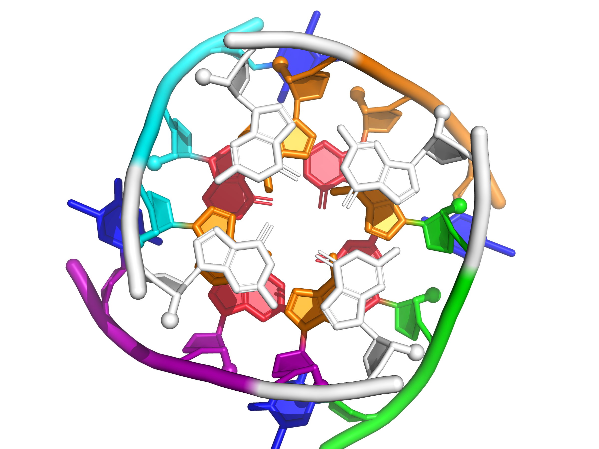

<table>
	<tr>
		<td align="center">g_quadruplex_inosine_fixed  RNA quadruplex from an inosine-tetrad, with inosine represented</td>
		<td align="center">hammerhead_3WJ_cat_OMC_fixed  Catalytic-like conformation, three-way-junction in hammerhead ribozyme, with O-methyl cytosine</td>
		<td align="center">t_loop_modified_fixed  T-loop from tRNA phe, modeled with chemical modifications</td>
	</tr>
	<tr>
		<td align="center">anticodon_phe  Anticodon loop from tRNAphe, modeled with chemical modifications</td>
		<td align="center">anticodon_cys  Anticodon loop from tRNAcys, modeled with chemical modifications</td>
		<td align="center">bru_gag_tetraplex  Bromouracil-GAG tetraplex</td>
	</tr>
	<tr>
		<td align="center">t_loop_modified_align  T-loop from tRNA phe, modeled with chemical modifications</td>
		<td align="center">hammerhead_3WJ_cat_OMC_align  Catalytic-like conformation, three-way-junction in hammerhead ribozyme, with O-methyl cytosine</td>
		<td></td>
	</tr>
</table>
